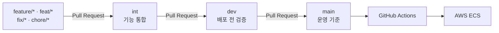

# MOPL

> 영화, TV 시리즈, 스포츠 콘텐츠를 발견하고 취향을 나누는 콘텐츠 큐레이션 플랫폼

## 프로젝트 개요

MOPL(ModuPlaylist)은 영화, TV 시리즈·시즌, 스포츠 등 여러 종류의 콘텐츠를 한곳에서 탐색하고 평가하며, 취향에 맞는 콘텐츠와 플레이리스트를 추천받을 수 있는 서비스입니다.

사용자는 좋아요와 리뷰, 플레이리스트를 통해 취향을 기록하고 다른 사용자를 팔로우할 수 있습니다. Watch Party에서는 여러 사용자가 같은 콘텐츠를 보며 채팅하고 재생 상태를 공유할 수 있으며, DM과 실시간 알림으로 사용자 간 소통을 이어갈 수 있습니다.

사용자 요청을 처리하는 REST API, WebSocket·SSE 기반 실시간 서버, 콘텐츠 수집과 추천을 수행하는 배치 서버를 분리하고, 공통 도메인과 인프라 구현을 별도 모듈로 관리합니다.

### 프로젝트 목표

- 영화·TV·스포츠를 아우르는 통합 콘텐츠 탐색 경험 제공
- 사용자 활동과 임베딩을 활용한 개인화 콘텐츠·플레이리스트 추천
- 키워드 검색과 의미 검색을 결합한 검색 품질 향상
- Watch Party, DM, 알림을 통한 실시간 소셜 경험 제공
- API, 실시간 처리, 배치를 분리해 트래픽 증가와 분산 환경에 대응
- Redis, Kafka, OpenSearch를 목적에 맞게 분리해 성능과 확장성 확보

## 팀원 구성

| 이름 | GitHub |
| --- | --- |
| 김태성 | https://github.com/ts8191 |
| 김수아 | https://github.com/suaripa |
| 이예진 | https://github.com/aHjinee |
| 전민지 | https://github.com/jeon-minji |
| 정다운 | https://github.com/nocturne9095 |

## 주요 기능

| 도메인 | 기능 |
| --- | --- |
| 사용자·인증 | 회원가입, 이메일 로그인, Google/Kakao OAuth2, JWT 인증, 프로필·권한 관리 |
| 콘텐츠 | 영화·TV 시리즈·시즌·스포츠 조회 및 관리, OTT·출연진·장르·태그 정보 제공 |
| 검색 | 키워드 검색, 자동완성, OpenSearch 기반 시맨틱 하이브리드 검색 |
| 리뷰·좋아요 | 콘텐츠 평점과 리뷰 작성, 콘텐츠 좋아요, 집계 정보 관리 |
| 플레이리스트 | 플레이리스트 생성·수정·구독, 콘텐츠 구성, AI 플레이리스트 생성 |
| 개인화 추천 | 초기 선호와 사용자 활동을 반영한 콘텐츠·플레이리스트 추천 |
| 실시간 인기 | Kafka 활동 이벤트와 Redis 시간 버킷을 이용한 최근 인기 콘텐츠 집계 |
| Watch Party | 파티 생성·참여·예약, 채팅, 재생 상태 동기화, 참가자·리마인더 관리 |
| 소셜 | 팔로우, 1:1 DM, SSE 실시간 알림 |
| 배치 | 외부 콘텐츠 수집, AI 태깅, 임베딩, 추천 생성, 인기 플레이리스트 계산, 종료된 Watch Party 및 관련 Redis 데이터 정리 |

## 기술 스택

### Backend

<p>
  
  
  
  
  
  
</p>

### Data · Search · Messaging

<p>
  
  
  
  
</p>

### Realtime · Authentication · API

<p>
  
  
  
  
  
  
</p>

### AI · External API

<p>
  
  
  
  
  
</p>

### DevOps · Monitoring

<p>
  
  
  
  
  
  
  
</p>

### Test · Build

<p>
  
  
  
</p>

## 모듈 및 패키지 구조

### 멀티모듈 구성

| 모듈 | 책임 |
| --- | --- |
| `app-api` | REST Controller, 요청·응답 DTO, 인증·인가, 애플리케이션 서비스, 이벤트 Consumer |
| `app-realtime` | Watch Party·DM WebSocket, 알림 SSE, 실시간 인증과 메시지 전달 |
| `app-batch` | 외부 콘텐츠 수집, 태깅, 임베딩, 추천·인기 계산, 데이터 정리 Job |
| `core` | Entity, Repository 인터페이스, 도메인 정책과 상태 변경 로직 |
| `infrastructure` | Redis, Kafka, OpenSearch, S3, 외부 API, AI 연동 구현 |

```text
.
├── app-api/
│   └── src/main/java/com/moduplaylist/api
│       ├── auth
│       ├── content
│       ├── dm
│       ├── follow
│       ├── notification
│       ├── playlist
│       ├── recommendation
│       ├── review
│       ├── trending
│       ├── user
│       └── watchparty
├── app-realtime/
│   └── src/main/java/com/moduplaylist/realtime
│       ├── dm
│       ├── notification
│       └── watchparty
├── app-batch/
│   └── src/main/java/com/moduplaylist/batch
│       ├── job
│       └── scheduler
├── core/
│   └── src/main/java/com/moduplaylist/core
│       └── {domain}/entity|repository|policy|exception
├── infrastructure/
│   └── src/main/java/com/moduplaylist/infrastructure
│       ├── ai
│       ├── kafka
│       ├── opensearch
│       ├── redis
│       ├── storage
│       ├── tmdb
│       └── sportsdb
├── docs/
├── docker/
└── monitoring/
```


## Git / GitHub 관리 전략

MOPL은 기능 브랜치를 바로 운영 브랜치에 합치는 방식이 아니라, 통합 단계를 나눈 **`int → dev → main` 다단계 브랜치 전략**을 사용합니다.


